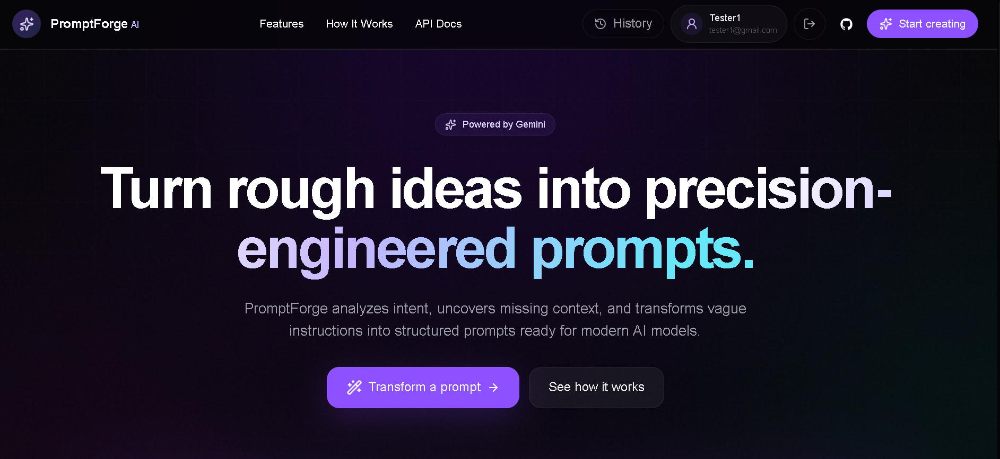
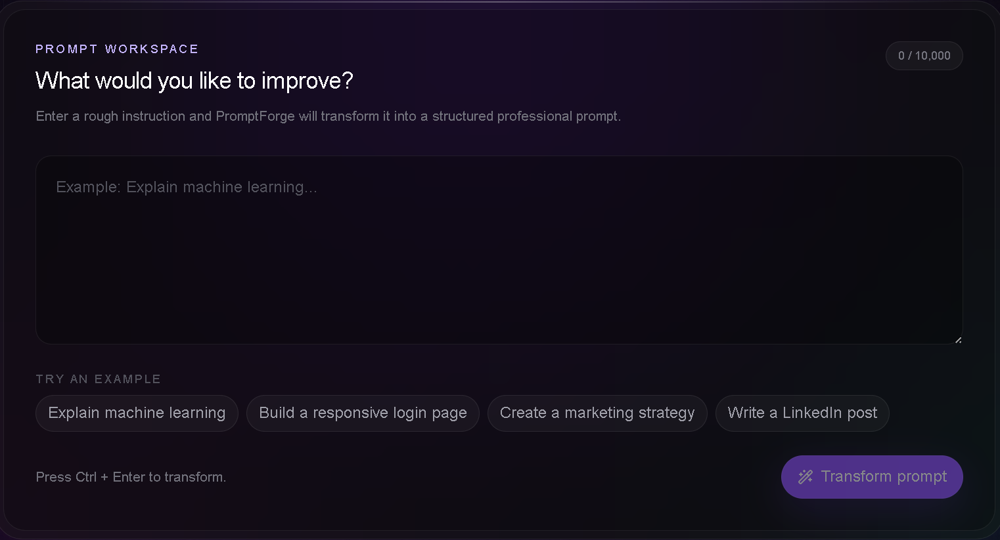
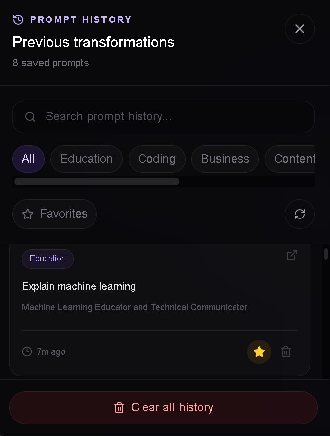
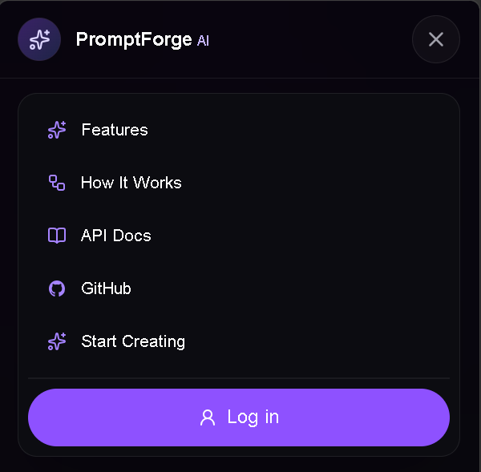

# PromptForge AI

> Transform weak, vague prompts into structured, context-rich prompts designed for better AI responses.

PromptForge AI is a full-stack AI prompt transformation platform built with Next.js, FastAPI, Gemini, PostgreSQL, and Supabase.

Instead of simply rewriting a sentence, PromptForge analyzes the user's intent and structures the request around role, goal, audience, context, constraints, requirements, and expected output.

## Live Demo

**Application:**  
ADD_YOUR_VERCEL_URL

**API:**  
ADD_YOUR_RENDER_URL

---

## Features

- AI-powered prompt transformation
- Structured prompt generation
- Prompt quality scoring
- Role, goal, audience, and context extraction
- Constraints and output-format generation
- JWT-based authentication
- Secure user sessions
- User-specific prompt history
- Searchable history
- Category filtering
- Favorite prompts
- Reopen previous transformations
- Delete saved prompts
- Responsive desktop/mobile interface
- Dedicated How It Works page
- Developer API documentation
- Health and database readiness endpoints

---

## Tech Stack

### Frontend

- Next.js
- React
- TypeScript
- Tailwind CSS
- shadcn/ui
- Motion
- Lucide React

### Backend

- Python
- FastAPI
- Pydantic
- SQLAlchemy
- Alembic
- JWT authentication

### AI

- Google Gemini API

### Database

- PostgreSQL
- Supabase

### Deployment

- Vercel — frontend
- Render — backend
- Supabase — managed PostgreSQL
- GitHub — source control

---

## Architecture

```text
                    ┌────────────────────┐
                    │       User         │
                    └─────────┬──────────┘
                              │
                              ▼
                    ┌────────────────────┐
                    │      Next.js       │
                    │      Frontend      │
                    │      Vercel        │
                    └─────────┬──────────┘
                              │
                         HTTPS / JSON
                              │
                              ▼
                    ┌────────────────────┐
                    │      FastAPI       │
                    │      Backend       │
                    │      Render        │
                    └──────┬───────┬─────┘
                           │       │
                    AI     │       │ Data
                           ▼       ▼
                ┌─────────────┐ ┌─────────────┐
                │   Gemini    │ │ PostgreSQL  │
                │     API     │ │  Supabase   │
                └─────────────┘ └─────────────┘
```

---

## How It Works

### 1. Enter a prompt

The user submits a simple or incomplete prompt.

Example:

```text
Explain machine learning
```

### 2. Analyze

PromptForge analyzes the user's intent and identifies information such as:

- Role
- Goal
- Audience
- Context
- Requirements
- Constraints
- Output format

### 3. Transform

Gemini converts the request into a structured prompt.

### 4. Return structured results

The frontend displays the transformed prompt and supporting prompt-engineering information.

### 5. Save history

Authenticated users can save and revisit their transformations.

---

## API

Main API routes include:

| Method | Endpoint | Description |
|---|---|---|
| GET | `/api/v1/health` | API health check |
| GET | `/api/v1/ready` | Database readiness |
| POST | `/api/v1/auth/register` | Register account |
| POST | `/api/v1/auth/login` | Authenticate user |
| GET | `/api/v1/auth/me` | Current user |
| POST | `/api/v1/transform` | Transform prompt |
| GET | `/api/v1/history` | User prompt history |
| GET | `/api/v1/history/{id}` | Retrieve saved prompt |
| PATCH | `/api/v1/history/{id}/favorite` | Toggle favorite |
| DELETE | `/api/v1/history/{id}` | Delete history record |

---

## Screenshots

### Homepage



### Prompt Transformation



### Prompt History



### Mobile UI



### API Documentation


---

## Local Development

### Clone

```bash
git clone YOUR_GITHUB_REPOSITORY_URL
cd prompt-transformation-lab
```

### Backend

```bash
cd backend

python -m venv .venv
```

Windows:

```powershell
.venv\Scripts\Activate.ps1
```

Install dependencies:

```bash
pip install -r requirements.txt
```

Configure environment variables using your local `.env`.

Run migrations:

```bash
alembic upgrade head
```

Start FastAPI:

```bash
uvicorn src.api.app:app --reload
```

Backend:

```text
http://localhost:8000
```

### Frontend

Open another terminal:

```bash
cd frontend
npm install
npm run dev
```

Frontend:

```text
http://localhost:3000
```

---

## Testing

Backend:

```bash
python -m pytest
```

Frontend:

```bash
npm run lint
npm run build
```

---

## Security

PromptForge includes:

- Password hashing
- JWT authentication
- User-specific history ownership
- HttpOnly session handling
- Environment-based secrets
- Request validation
- Protected API routes
- CORS configuration

Secrets and production credentials are never committed to the repository.

---

## Project Structure

```text
prompt-transformation-lab/
│
├── backend/
│   ├── alembic/
│   ├── src/
│   │   ├── api/
│   │   ├── database/
│   │   ├── schemas/
│   │   └── services/
│   └── tests/
│
├── frontend/
│   ├── public/
│   └── src/
│       ├── app/
│       ├── components/
│       ├── lib/
│       └── providers/
│
├── docs/
│   └── screenshots/
│
└── README.md
```

---

## Future Improvements

Potential future improvements include:

- Prompt versioning
- Prompt comparison
- Prompt templates
- Advanced evaluation
- Team workspaces
- Usage analytics
- Streaming AI responses
- Additional LLM providers

---

## Author

**Salim Momin**

Built as a full-stack AI engineering portfolio project.

## License

This project is intended for educational and portfolio purposes.